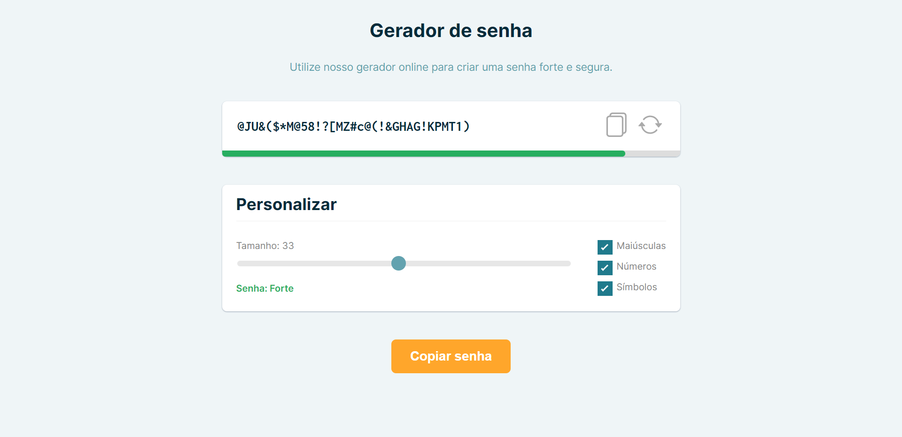

# Password Generator

This is a project of a Password Generator, created with HTML, CSS and Javascript (Vanilla). The password is randomly generated based on user's choice of using uppercases, numbers or symbols. The password force is calculated by the use of these characters and it's length. 

---
## Table of contents

- [Overview](#🌞-overview)
  - [Screenshot](#📸-screenshot)
  - [Links](#🔗-links)
- [My process](#🤔-my-process)
  - [Built with](#🏗️-built-with)
  - [What I learned](#🧠-what-i-learned)
  - [Useful resources](#👩‍💻-useful-resources)
- [Author](#😸-author)

---

## 🌞 Overview

### :camera_flash: Screenshot



### 🔗 Links

- Solution URL: [GitHub Repository](https://github.com/Padilha04/Password-Generator)
- Live Site URL: [GitHub Page](https://padilha04.github.io/Password-Generator/)

---

## 🤔 My process

### 🏗️ Built with

- Semantic HTML5 markup
- CSS custom properties
- Javascript (Vanilla)
- DOM

### 🧠 What I learned

This is my second Javascript focused project, so I basically used most of the Javascript concepts I've learned so far. This includes loop functions and programming logic.

I've algo added a function to make sure the password had at least one of the selected character types. This it what I'm proud of learning in this challenge:

```javascript
function checkPasswordValidByType(charType) {
    var check = false;
    let checkResult = "";
    for (i = 0; i < charType.length; i++) {
      check += password.includes(charType.substring(i, i + 1));
    }

    if (check === 0) {
      checkResult = false;
    } else {
      checkResult = true;
    }
    return checkResult;
  }

  if (
    ((upperCaseEl.checked === true &&
      checkPasswordValidByType(upperChars) === true) ||
      upperCaseEl.checked === false) &&
    ((numbersEl.checked === true &&
      checkPasswordValidByType(numbersChars) === true) ||
      numbersEl.checked === false) &&
    ((symbolsEl.checked === true &&
      checkPasswordValidByType(symbolsChars) === true) ||
      symbolsEl.checked === false)
  ) {
    passwordInput.value = password;
  } else {
    generatePassword();
  }
```

---

## 😸 Author

### Amanda Padilha
- Portfolio - [Amanda Padilha](https://amandapadi.notion.site/Amanda-Padilha-Portf-lio-f5cc302c77014bea8a538ab908342784)
- Github - [Padilha04](https://github.com/Padilha04)
- LinkedIn - [Amanda Padilha](www.linkedin.com/in/amanda-padilha)
- Frontend Mentor - [@Padilha04](https://www.frontendmentor.io/profile/yourusername)
